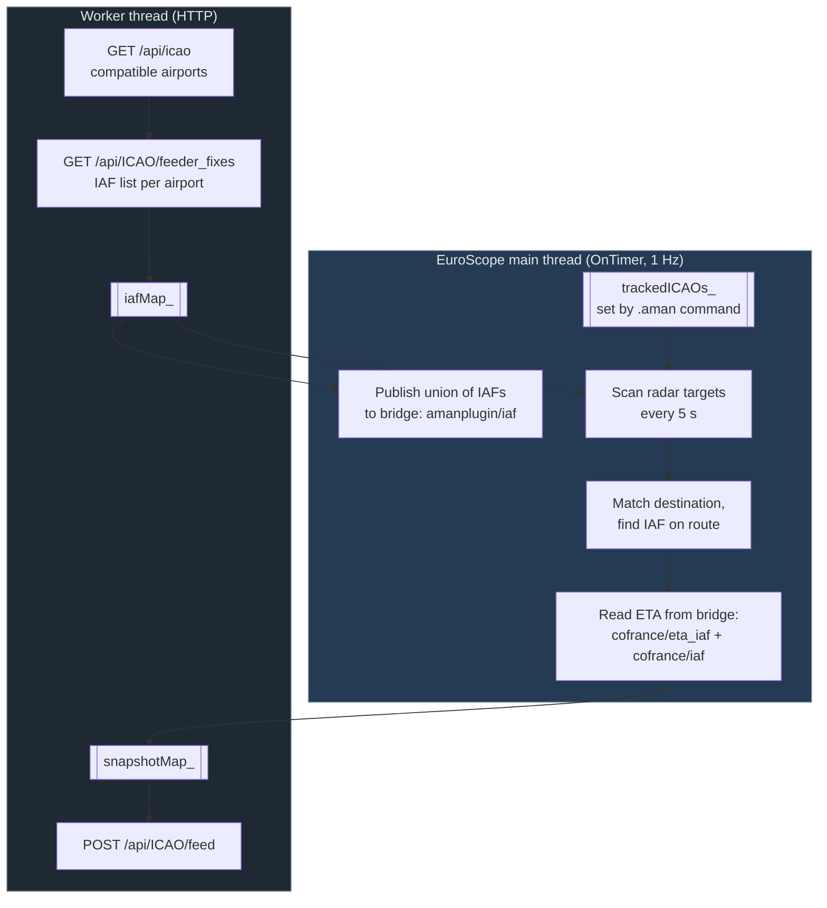

> [!NOTE]
> **This README was generated by AI** (Claude) from the source tree at version 0.0.1.
> It was written by reading the code rather than from author-supplied notes, so while
> every statement below was checked against the source, wording and emphasis are the
> model's. Treat it as a starting point and correct anything that misrepresents intent.

# AMAN Plugin

An Arrival Manager feeder for [EuroScope](https://www.euroscope.hu/), built for the
French vACC. It watches inbound traffic for the airports a controller is working,
works out which Initial Approach Fix each arrival will cross, and posts a periodic
snapshot to the AMAN backend so the sequencer can build an arrival order.

The plugin does not sequence traffic itself and draws nothing on the radar screen.
It is the data feed; the sequencing lives server-side.

---

## Table of contents

- [What it does](#what-it-does)
- [Requirements](#requirements)
- [Installation](#installation)
- [Commands](#commands)
- [How it works](#how-it-works)
- [Plugin Bridge integration](#plugin-bridge-integration)
- [Backend API](#backend-api)
- [Building from source](#building-from-source)
- [Project layout](#project-layout)
- [Troubleshooting](#troubleshooting)
- [Contributing](#contributing)

---

## What it does

1. Asks the backend which airports it supports, and what the feeder fixes (IAFs) are
   for each of them.
2. Publishes that IAF list onto the [EuroScope Plugin Bridge](#plugin-bridge-integration)
   so other plugins can see which fixes are being sequenced.
3. Lets the controller pick which of those airports to actually track, with a
   `.aman` command.
4. Every few seconds, scans radar targets for arrivals into a tracked airport, finds
   the IAF on each one's route, and reads the predicted ETA over that fix from
   CoFrance via the bridge.
5. POSTs the resulting snapshot to the backend.

The ETA is **read, not computed**. This plugin has no trajectory model; CoFrance
already integrates a wind-aware prediction per flight, so the number comes from
there. When CoFrance is not loaded, snapshots are still sent — the ETA field is
simply `null`.

---

## Requirements

| | |
|---|---|
| **EuroScope** | 3.2 or later (32-bit, as all EuroScope builds are) |
| **EuroScopeBridge.dll** | Required. Distributed [separately](https://github.com/AlexisBalzano/Euroscope-Plugin-Bridge/releases) — see below |
| **CoFrance** | Optional. Without it, `eta_iaf_utc` is `null` in every snapshot |
| **Backend access** | An `AUTH_SECRET` bearer token for the AMAN API |

### About the bridge

`EuroScopeBridge.dll` is a **standalone plugin the user installs themselves**, and
must be loaded in EuroScope under *Other Settings > Plug-ins*. Do not ship a copy
alongside this plugin: Windows maps only one module of a given base name per process,
so bundled copies silently collapse onto whichever was loaded first, which may be far
older than yours.

If the bridge is missing, the plugin says so once in the message window after about
ten seconds and then stops mentioning it. Without the bridge the plugin cannot
publish its IAF list or read ETAs.

---

## Installation

1. Build `AMAN.dll` (see [Building from source](#building-from-source)) or take a
   release binary.
2. In EuroScope: *Other Settings > Plug-ins > Load*, and select `AMAN.dll`.
3. Load `EuroScopeBridge.dll` the same way if it is not already there.
4. Tell the plugin which airports to track — see below. Until you do, **nothing is
   posted**: the tracked-airport set starts empty.

---

## Commands

Typed into the EuroScope command line. The leading `.` is optional.

| Command | Effect |
|---|---|
| `.aman version` | Prints the plugin version to the message window |
| `.aman <ICAO> [ICAO ...]` | Replaces the tracked airport set |
| `.aman` | Prints the command list |

```
.aman LFPG LFPO
```

Each ICAO is validated before it is accepted: it must be four alphabetic characters
**and** appear in the compatible-airport list the backend published. Anything else is
silently skipped, so a typo results in a smaller set rather than an error — check the
result if a field seems to be missing.

The set is **replaced, not extended**. `.aman LFPG` followed by `.aman LFPO` leaves
only LFPO tracked.

---

## How it works

Two threads, with distinct jobs:

- **EuroScope main thread** (`OnTimer`, once per second) — bridge attach and
  registration, radar target scanning, snapshot assembly, command handling. Every
  EuroScope and bridge call happens here; neither API is thread-safe.
- **Worker thread** — all HTTP. Started at construction, joined at shutdown. It never
  touches EuroScope state; it exchanges data with the main thread through mutex-guarded
  maps, and reports errors by queueing messages that `OnTimer` drains.



### Timing

| Constant | Value | Meaning |
|---|---|---|
| `PERIODIC_POST_TIME_INTERVAL` | 5 s | Snapshot rebuild and POST cadence |
| `CONFIG_REFRESH_INTERVAL` | 60 s | Airport and IAF list refresh |
| `MAX_IAF_LOOKUP_IN_ROUTE` | 20 | Route points searched, counting back from the destination |
| `MISSING_TICKS_BEFORE_NOTICE` | 10 | Ticks before the missing-bridge notice is printed |

### Matching an arrival to an IAF

For each radar target with a valid position and a correlated flight plan:

1. Skip it unless its destination is in the tracked set.
2. Walk the extracted route **backwards from the destination**, at most
   `MAX_IAF_LOOKUP_IN_ROUTE` points, and take the first fix that is an IAF for that
   destination.
3. Read the ETA for that fix from the bridge.

Snapshots are sent even when the flight list is empty, which keeps the backend session
alive.

---

## Plugin Bridge integration

The plugin claims the provider id **`amanplugin`** and both publishes and consumes.

### Published

| Field | Type | Scope | Description |
|---|---|---|---|
| `amanplugin/iaf` | `STR` | Global | Comma-separated IAF names, e.g. `MOPAR,LORNI,OKRIX` |

The union of the IAFs across every compatible airport, rewritten whenever the backend
config refreshes. Capped at **16 fixes / 97 bytes**; beyond that the plugin reports an
error and publishes nothing rather than truncating.

### Consumed

| Field | Type | Scope | Description |
|---|---|---|---|
| `cofrance/eta_iaf` | `I64` | Aircraft | Predicted ETA over the IAF, UTC Unix seconds |
| `cofrance/iaf` | `STR` | Aircraft | Which fix that ETA refers to |

Both are resolved lazily and retried every tick, because EuroScope loads plugins in
whatever order the user's settings file lists them — CoFrance may well register after
this plugin does.

`cofrance/iaf` is checked against the fix this plugin matched **before the ETA is
accepted**. The two scan differently — CoFrance walks the whole remaining route
forward from the aircraft, this plugin scans a window backwards from the destination —
so they can legitimately land on different fixes. An ETA over a fix that is not the
one being reported would be a confident wrong number, so a mismatch yields `null`.

An unset value is the ordinary case, not an error: CoFrance clears both fields as soon
as a flight passes its IAF or is vectored off the route it was predicted along.

---

## Backend API

Base URL: `https://aman-vatsim.lunair.fr`. Timeouts are 2 s connect, 3 s read/write,
keep-alive on.

### `GET /api/icao`

Airports the backend can sequence.

```json
{ "icao": ["LFPG", "LFPO", "LFMN"] }
```

### `GET /api/{icao}/feeder_fixes`

Feeder fixes for one airport. Entries without a string `iaf` member are skipped.

```json
{
  "icao": "LFPG",
  "fixes": [ { "iaf": "MOPAR" }, { "iaf": "LORNI" } ]
}
```

### `POST /api/{icao}/feed`

The snapshot.

**Headers**

| Header | Value |
|---|---|
| `User-Agent` | `AMANplugin` |
| `Content-Type` | `application/json` |
| `Authorization` | `Bearer <AUTH_SECRET>` |
| `X-Timestamp` | Current UTC Unix seconds, for replay protection |

**Body**

```json
{
  "type": "SNAPSHOT",
  "flights": [
    {
      "callsign": "AFR123",
      "aircraftType": "A320",
      "departure": "LFBO",
      "iaf": "MOPAR",
      "eta_iaf_utc": "08:31:07",
      "altitude": 240,
      "verticalSpeed": -1200,
      "finalAltitude": 36000,
      "groundspeed": 420,
      "lat": 48.85,
      "lon": 2.35
    }
  ]
}
```

`eta_iaf_utc` is `"HH:MM:SS"` UTC, or **bare `null`** when no ETA is available —
CoFrance absent, nothing published for the flight, or the aircraft already past the
fix. It is deliberately never `""`, which would read as a time that failed to parse
rather than an absent one.

Errors are reported once to the message window and then suppressed until the next
successful call, so an unreachable backend does not flood the controller.

---

## Building from source

### Prerequisites

- **Visual Studio** with the MSVC C++ toolset and the **x86** target
- **CMake** 3.14 or later
- **Git** — vcpkg is a submodule
- Roughly 2 GB of disk for the vcpkg build tree (OpenSSL is compiled from source)

### Clone

```bash
git clone --recurse-submodules https://github.com/vaccfr/AMAN-Plugin.git
```

If you already cloned without submodules:

```bash
git submodule update --init --recursive
```

### Create `Secret.h`

`src/Secret.h` is **gitignored and not in the repository**. Create it yourself:

```cpp
#pragma once
#include <string>

static const std::string AUTH_SECRET = "your-token-here";
```

> [!WARNING]
> This token is compiled into the DLL and is therefore recoverable from the binary by
> anyone who has it. Every controller running a given build shares the same
> credential. Treat it as a shared secret with a limited blast radius, not as a
> per-user identity.

### Configure and build

```bash
cmake -S . -B build -G Ninja -DCMAKE_BUILD_TYPE=Release
```

```bash
cmake --build build
```

The DLL lands in `build/bin/AMAN.dll`.

The first configure takes several minutes: vcpkg bootstraps and builds OpenSSL,
nlohmann-json and spdlog for the `x86-windows-static` triplet.

### Build options

| Option | Effect |
|---|---|
| `-DDEV=1` | Defines `DEV=1` |
| `-DDEBUG=1` | Defines `DEBUG=1` |

### Static CRT — do not override the triplet

The plugin links the **static CRT** (`/MT`), so the shipped DLL needs no Visual C++
redistributable. Every vcpkg dependency must therefore be built against the static CRT
too, which is what the `x86-windows-static` triplet does.

A `-md` triplet builds them against the *dynamic* CRT, and the only symptom is a wall
of unresolved `__imp__*` symbols out of libcrypto at link time — which says nothing
about the actual cause. `CMakeLists.txt` fails fast with an explanation instead.

**In CLion**, this means leaving the *CMake options* box empty for every profile
(*Settings > Build, Execution, Deployment > CMake*). The defaults in `CMakeLists.txt`
are correct on their own.

---

## Project layout

```
src/
  AMANPlugin.h/.cpp     Plugin class: lifecycle, OnTimer, worker thread,
                        bridge registration, HTTP calls
  Secret.h              AUTH_SECRET (gitignored — create it yourself)
  Version.h.in          Template; CMake generates Version.h into the build dir
  core/
    CompileCommands.h   .aman command parsing (header-only, inline definitions)
    Helpers.h           Currently empty

External/
  EuroscopeSDK/         EuroScope plugin SDK headers + prebuilt import library
  esbridge/             Plugin Bridge C ABI header (header-only client shim)
  httplib/              cpp-httplib, single header

vcpkg/                  Submodule; provides nlohmann-json, openssl, spdlog
```

> [!NOTE]
> `EuroScopePlugIn.h` has **no `#include` directives of its own** and refers to
> `POINT`, `RECT`, `HDC` and `COLORREF` as though they are already in scope.
> `<windows.h>` must be included before it, or the SDK fails to parse and the compiler
> blames whichever include sits at the top of the block.

---

## Troubleshooting

**"EuroScope Plugin Bridge is not loaded"**
Install `EuroScopeBridge.dll` and load it in *Other Settings > Plug-ins*. Said once,
about ten seconds after startup.

**Nothing is being posted**
The tracked airport set starts empty. Run `.aman <ICAO>`. If the ICAO does not appear
in the backend's compatible list it is skipped silently.

**`eta_iaf_utc` is always `null`**
CoFrance is not loaded, or it is publishing a different fix than this plugin matched,
or the aircraft has passed its IAF. All three are ordinary states, not errors.

**"Another loaded plugin already owns the amanplugin bridge provider id"**
Two copies of this plugin are loaded. Said once, then registration stops being retried.

**Link errors: unresolved `__imp__*` symbols from libcrypto**
The vcpkg triplet was overridden to a `-md` variant. See
[Static CRT](#static-crt--do-not-override-the-triplet).

---

## Contributing

No CI or contribution guide is configured in this repository yet. The codebase leans
on explanatory comments where behaviour is non-obvious — particularly around thread
boundaries and the bridge ABI — and the existing style is worth matching.

Two constraints that are easy to trip over:

- **Every bridge call must be made on the EuroScope main thread.** The worker thread
  must not touch `api_`.
- **Nothing may block `OnTimer`.** It runs on EuroScope's UI thread; HTTP belongs on
  the worker.

## License

No license file is present in this repository. Contact the French vACC before
redistributing.
